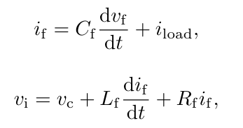
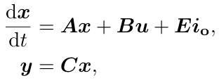
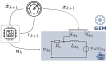
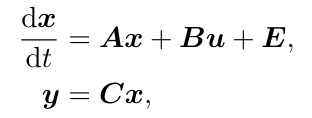
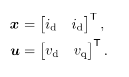
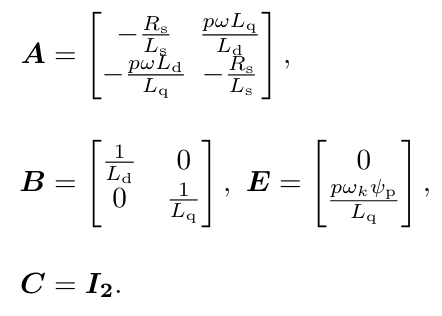

# Steady-State Error Compensation for Reinforcement Learning Control

[Read the Paper](https://arxiv.org/abs/2201.13331) Link will follow when published

Reference tracking problems are common in power grids as well as in automotive applications, and the utilization 
of RL controllers in such scenarios feature better performance than state-of-the-art methods during transients. 
However, they still exhibit non vanishing steady-state errors.
Therefore, the presented **S**teady-state **E**rror **C**ompensation tool will extend an established actor-critic 
based RL approach to compensate the steady-state error and close this gap.

Suggestions or experiences concerning applications of SEC are welcome!

## Application Examples - Models
### Electrical Power Grid Application
The first exemplary use case to show the benefits of the SEC approach is an 
electrical power grid application.
The [OpenModelica Microgrid Gym toolbox](https://github.com/upb-lea/openmodelica-microgrid-gym) 
is used to model the control plant.
The same setting as in [this paper](https://ieeexplore.ieee.org/document/9363170) 
is used. 


The dynamics of the shown average model of an inverter and a standard LC filter 
configuration (`L_f`, `C_f`), with inductor filter current `i_f`,
voltage over the filter capacitor `v_c` and output 
load current `i_load` can be linearly described as:



with the switch voltage `v_i`.
Above, `R_f` is the inductors' internal resistance, 
while it is assumed that the internal resistance of the capacitors is negligible. 
Moreover, the model can be described linearly in the state space



where `x` contains the states, 
the inputs are `u` and the load current can be interpreted as a disturbance:


The indices abc refer to a the three phases of a common three-phase electrical power grid
(Compare for the gray 2 other phases shown in the figure above).

The corresponding state-space matrices are


Above, `C` is the 6x6 identity matrix assuming that the filter currents and voltages 
are measured while the load currents are not available as a measurement signals.

So far, the relevant currents and voltages
are represented as vectors in a fixed abc reference frame.
Hence, in steady state they are rotating with the frequency of the sinusoidal supply voltage. 
Using the Park transformation, the system variables can be mapped into a rotating 
reference frame. 
Here, the d-axis is aligned with the a-axis of the rotating three-phase system, 
the q-axis is orthogonal to the d-axis and the third is the zero component:


If the angular speed `omega` of the rotating frame is set equal to the grid frequency, 
the balanced sinusoidal grid voltages and currents become stationary DC-variables. 
This simplifies the control design, allowing for the effective application of linear feedback controllers.
More information on the basics of power electronic control we refer to standard textbooks. 
This transformation is used in the calculations to perform the control in the rotation dq reference frame.

As baseline for the investigations a PI controller is used.
It is implemented as a cascade of voltage and current controllers with configuration 


These parameters are calculated using the in [this paper](https://ieeexplore.ieee.org/document/9363170) 
described safe Bayesian optimization.
100 samples are drawn resulting in a performance increase of about 43 %, 
compared to the analytical controller layout.

### Electrical Drive Application
An electric drive application is used as the second example.
The [Gym Electric Motor toolbox](https://github.com/upb-lea/gym-electric-motor) is used to model the control plant.




Like shown in the figure the plant is modeled in the rotation dq reference frame, too 
(For more information see power grid example explanation).


Again, the model can be described linearly in the state space:



where again `x` contains the states and the inputs are `u`:



The corresponding state-space matrices are



Here, `omega` describes the angular speed of the motor, 
multiplied with the magnetic flux (`psi`) resulting in the electromagnetic force (EMF) 
and `p` the number of pol pairs.
`C` is the 2x2 identity matrix assuming that the all states are measurable.
Here, the disturbance `E` is dependent on the rotor speed - 
which is chosen to be constant in the application.

As baseline for the investigations again a PI controller is used to control 
the currents in the rotation dq reference frame.
The parameters are determined with a design tool provided by GEM 
(based on the symmetrical optimum) and are chosen as follows:


## Citing
Detailed informations can be found in the article 
"Steady-State Error Compensation in Reference Tracking Problems with Reinforcement Learning Control".
Please cite it when using the provided code:

```
@misc{weber2022,
      title={Steady-State Error Compensation in Reference Tracking and Disturbance Rejection Problems for Reinforcement Learning-Based Control}, 
      author={Daniel Weber and Maximilian Schenke and Oliver Wallscheid},
      year={2022},
      eprint={2201.13331},
      archivePrefix={arXiv},
      primaryClass={eess.SY}
      }
```

## Usage
The ```jupyter notebook```  ```show_results.ipynp``` provides executable files to reproduce the plots and results shown in the paper.

Use
```angular2html
run_OMG_experiment()   

run_GEM_experiment()
```

to visualize the results.
Like shown in the notebook

```angular2html
optuna_optimize_sqlite(ddpg_objective, study_name=STUDY_NAME, sampler=TPE_sampler)
```

can be used to train DDPG agents.
In the respective (OMG/GEM / util) config file can be adjusted weather a standard DDPG 
(``` env_wrapper='no_I_term'```) 
or an SEC-DDPG (``` env_wrapper='past'```) should be trained.
The data is logged depending on the ```loglevel``` to the in ```meas_data_folder```defined folder.
Be aware that the calculation can be time consuming.
